# Jejudo Vision Package

- **구현 방식:** ROS1·OpenCV에서 렌즈 왜곡 보정, Canny·IPM 기반 BEV 변환, Sliding Window와 이전 차선 피팅 주변 탐색을 결합했습니다.
- **수행 기능:** 양쪽·단일 차선에서 중심 경로를 생성하고, 픽셀 좌표를 차량 기준 미터 좌표로 변환해 `nav_msgs/Path`로 발행했습니다.
- **설계 특징:** 이전 경로 기반 동적 중심점, 차선 폭·좌우 관계 검사, 재탐색과 시간적 평활화, 실시간 파라미터 조정으로 차선 추적을 보완했습니다.

> **CV·자기소개용 PR 포트폴리오**입니다. 프로젝트에서 수행한 역할, 구현 방식과 문제 해결 경험을 소개합니다.

**제주 자율주행 대회 · 1/5 스케일 차량 · Vision Perception & Local Path Generation**

전방 카메라 영상에서 차선을 찾고 제어기가 추종할 수 있는 중심 경로를 만드는 비전 파트를 담당했습니다. 노트북을 탑재한 소형 차량의 연산 환경을 고려해 OpenCV 영상처리와 이전 프레임 추적을 결합했습니다.

[나의 기여](#나의-기여) · [문제 해결 경험](#문제-해결-경험) · [설계 자료](#설계-자료) · [상세 구현 기록](docs/IMPLEMENTATION.md)

## 나의 기여

| 작업 | 구현 방식 | 제공한 기능 |
| --- | --- | --- |
| 영상 전처리 | 렌즈 왜곡 보정·Canny·IPM 기반 BEV | 차선 탐색에 사용할 상단 시점 영상 생성 |
| 차선 검출·추적 | Sliding Window와 이전 피팅 주변 탐색 | 초기 검출·프레임 간 추적·실패 시 재탐색 |
| 경로 생성 | 양쪽 차선 중심 또는 단일 차선 오프셋 | 부분 차선 소실 상황의 중심 경로 추정 |
| 추적 보완 | 이전 경로 기반 동적 중심점·폭/역전 검사·평활화 | 좌우 차선 연관성 유지와 프레임 간 흔들림 완화 |
| 제어 연결·튜닝 | 차량 기준 미터 좌표 변환·ROS Path·Dynamic Reconfigure | 제어용 경로 발행과 실행 중 파라미터 조정 |

## 문제 해결 경험

- **급커브 후 좌우 차선 오인:** 고정 영상 중심 대신 이전 경로의 하단점을 기준으로 동적 중심점을 구성하고, 차선 폭과 좌우 관계를 검사했습니다.
- **일시적인 차선 소실:** 이전 피팅 주변 우선 탐색과 전역 재탐색을 연결하고, 제한된 프레임 동안 기존 피팅을 유지했습니다.
- **잘못된 경로와 평활화의 한계:** 칼만 필터 적용을 시도하며 잘못된 인지 결과는 smoothing만으로 해결하기 어렵다는 점을 확인했습니다. 기존 기하 검증과 별도로 경로 이상치 검증을 강화해야 한다는 개선 방향을 정리했습니다.
- **시스템 통합의 교훈:** 센서별 모드 전환, 짧은 전방 인식 거리, 차량의 중량·조향부 내구성도 전체 주행 결과에 영향을 준다는 점을 기록했습니다.

## 설계 자료

기존 코드의 영상 처리 흐름과 ROS 입출력을 정리한 자료입니다. 실행 영상과 설계도는 구분해 소개합니다.

영상 처리 파이프라인 보기

[ROS 입출력 설계도](diagrams/05_topic_io.svg) · [전체 다이어그램 설명](Vision_Mermaid_Diagrams.md)

## 구현 근거와 기록

[영상 처리](src/process.py) · [차선 검출·추적](src/sliding_window2.py) · [차량 좌표 Path 생성](src/ros_utils.py) · [ROS 연결·실시간 튜닝](src/main.py)

기존 README의 프로젝트 배경, 결과·한계와 개선 계획, 실행 안내는 [상세 구현 기록](docs/IMPLEMENTATION.md)에 보존했습니다. 기존 기록의 약 80 FPS는 측정 환경·구간이 충분히 명시되어 있지 않아, 대표 성과 수치로 사용하지 않았습니다.
