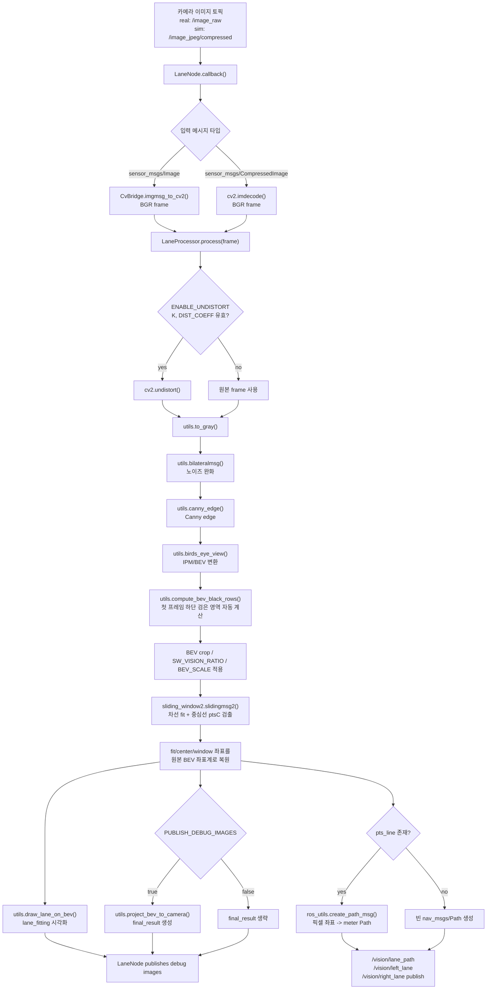
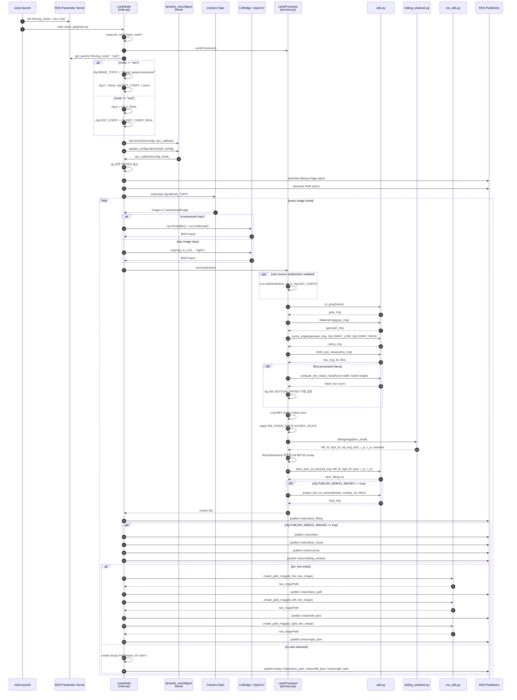
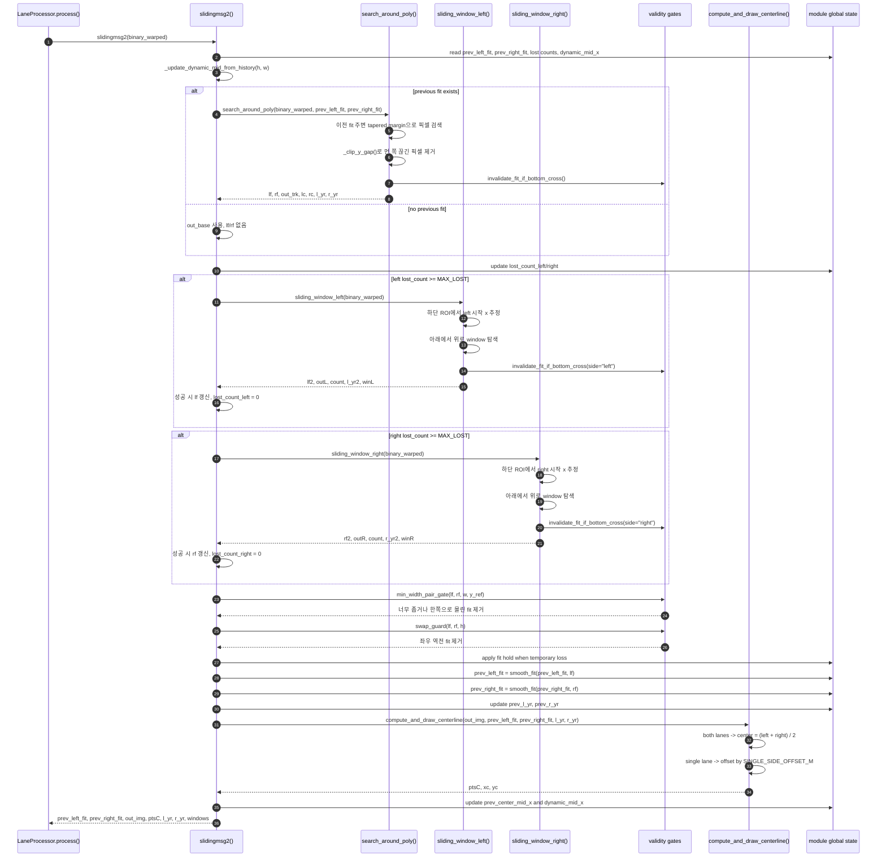
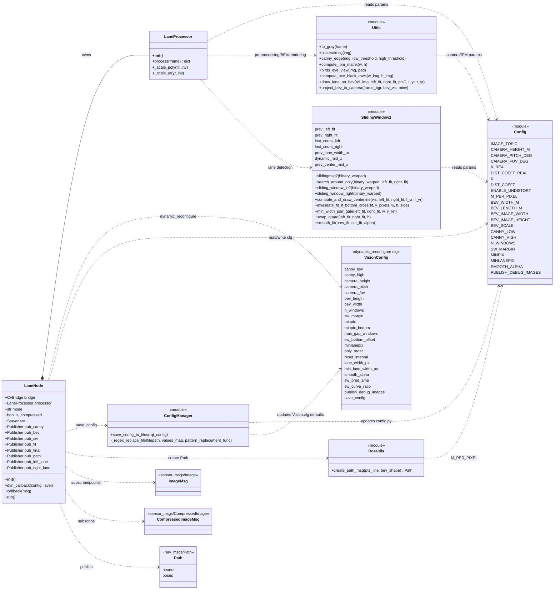
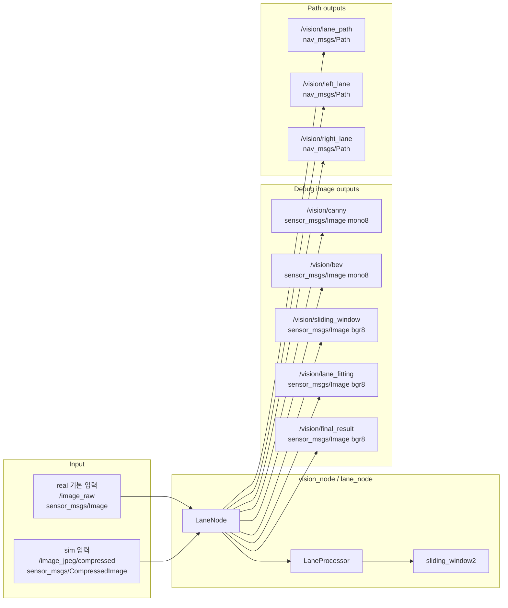

# vision_pkg Mermaid Diagrams

이 문서는 `catkin_ws/src/vision_pkg`의 현재 소스코드를 기준으로 차선 인식 파이프라인, ROS 메시지 흐름, 주요 클래스/모듈 관계를 Mermaid Markdown으로 정리한 문서입니다.

## Rendered Images

전체 다이어그램 합본 PDF: [Vision_Mermaid_Diagrams.pdf](Vision_Mermaid_Diagrams.pdf)

| Diagram | High-res PNG | SVG | PDF |
|---|---|---|---|
| 전체 파이프라인 | [01_pipeline_large.png](diagrams/high_res/01_pipeline_large.png) | [01_pipeline_large.svg](diagrams/high_res/01_pipeline_large.svg) | [01_pipeline_large.pdf](diagrams/high_res/01_pipeline_large.pdf) |
| ROS 런타임 시퀀스 | [02_ros_runtime_sequence_large.png](diagrams/high_res/02_ros_runtime_sequence_large.png) | [02_ros_runtime_sequence_large.svg](diagrams/high_res/02_ros_runtime_sequence_large.svg) | [02_ros_runtime_sequence_large.pdf](diagrams/high_res/02_ros_runtime_sequence_large.pdf) |
| sliding_window2 내부 시퀀스 | [03_sliding_window_sequence_large.png](diagrams/high_res/03_sliding_window_sequence_large.png) | [03_sliding_window_sequence_large.svg](diagrams/high_res/03_sliding_window_sequence_large.svg) | [03_sliding_window_sequence_large.pdf](diagrams/high_res/03_sliding_window_sequence_large.pdf) |
| 클래스/모듈 다이어그램 | [04_class_module_diagram_large.png](diagrams/high_res/04_class_module_diagram_large.png) | [04_class_module_diagram_large.svg](diagrams/high_res/04_class_module_diagram_large.svg) | [04_class_module_diagram_large.pdf](diagrams/high_res/04_class_module_diagram_large.pdf) |
| 토픽 입출력 요약 | [05_topic_io_large.png](diagrams/high_res/05_topic_io_large.png) | [05_topic_io_large.svg](diagrams/high_res/05_topic_io_large.svg) | [05_topic_io_large.pdf](diagrams/high_res/05_topic_io_large.pdf) |

기존 저용량 PNG/SVG는 `diagrams/`에 남겨두었고, 발표/보고서 삽입용은 `diagrams/high_res/`의 `_large` 파일을 사용하면 됩니다.

## 1. 전체 파이프라인

## 2. ROS 런타임 시퀀스 다이어그램

## 3. sliding_window2 내부 시퀀스 다이어그램

## 4. 클래스/모듈 다이어그램

## 5. 토픽 입출력 요약

## 6. 코드 기준 핵심 포인트

- `main.py`: ROS 노드 초기화, `driving_mode`에 따른 입력 토픽/카메라 파라미터 선택, dynamic_reconfigure 콜백, 이미지/Path 퍼블리시를 담당합니다.
- `process.py`: 프레임 1장을 받아 왜곡 보정, grayscale, bilateral filter, Canny, BEV, crop/scale, sliding window, 시각화, 결과 dict 생성을 담당합니다.
- `sliding_window2.py`: 이전 프레임 fit 기반 tracking을 먼저 시도하고, 실패하면 좌/우 sliding window reset을 수행합니다. fit 검증, hold, smoothing, 중심선 계산까지 포함합니다.
- `utils.py`: OpenCV 기반 전처리, IPM homography 계산, BEV 변환, BEV 시각화, 카메라 이미지 재투영을 제공합니다.
- `ros_utils.py`: BEV 픽셀 중심선을 `nav_msgs/Path`의 meter 좌표로 변환합니다. 좌표계는 차량 기준 전방 `x`, 좌측 `y`, frame_id는 `"stier"`입니다.
- `config.py`: 대부분의 런타임 파라미터를 전역 변수로 관리합니다. RQT 변경은 `main.py`의 `dyn_callback()`을 통해 이 값들에 반영됩니다.
- `config_manager.py`: RQT에서 `save_config`가 켜지면 현재 파라미터를 `src/config.py`와 `cfg/Vision.cfg`에 정규식으로 저장합니다.
